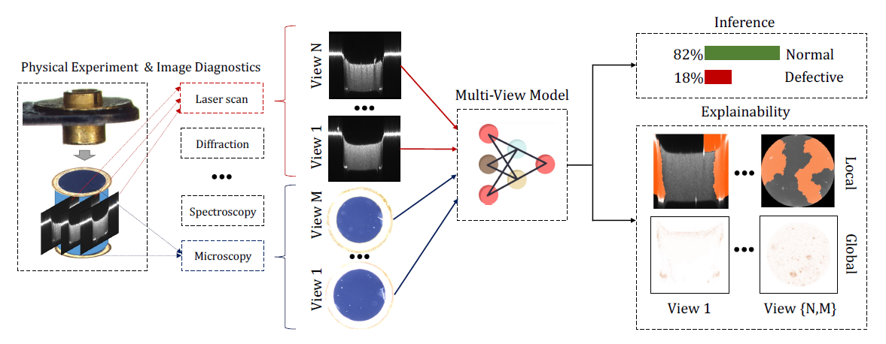
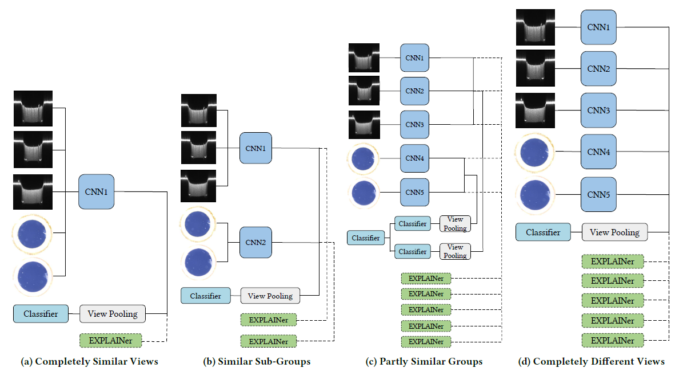
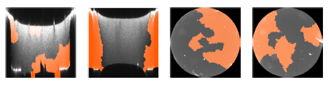
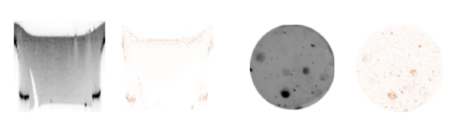

# Explainable Multi-View Deep Networks Methodology for Experimental Physics


# Introduction
Physical experiments often involve multiple imaging representations, such as X-ray scans, microscopic or spectroscopic images, and diffraction patterns. Deep learning models have been widely used for supervised analysis in these experiments. Combining these different image representations is frequently required to analyze and make a decision properly. Consequently, multi-view data has emerged - datasets where each sample is described by multiple feature representations or _views_ from different angles, sources, or modalities. These problems are addressed with the concept of multi-view learning. Understanding the decision-making process of deep learning models is essential for reliable and credible analysis. Hence, many explainability methods have been devised recently. Nonetheless, there is a lack of proper explainability in multi-view models, which are challenging to explain due to their architectures.

In this paper, we suggest different multi-view architectures for the vision domain, each suited to another problem, with different relations between its views, and present a methodology for explaining these models. To demonstrate the effectiveness of our methodology, we focus on the domain of High Energy Density Physics (HEDP) experiments, where multiple imaging representations are used to assess the quality of foam samples. We expand the existing dataset and apply our methodology to classify the foam samples using the suggested multi-view architectures.
Through experimental results, we showcase the improvement of accurate architecture choice on both accuracy - 78\% to 84\% and AUC - 83\% to 93\% and present a trade-off between performance and explainability. Specifically, we demonstrate that our approach enables the explanation of individual one-view models, providing insights into the decision-making process of each view. This comprehensive understanding enhances the interpretability of the overall multi-view model.
## Multi-View model Architecture  ##

**Multi-View model gets as an input 5 different views and outputs a classification and the explanation behind it. The explainability is both local and global.**


# Instructions
## Requirments
First, clone the code provided here.
```
clone https://github.com/Scientific-Computing-Lab-NRCN/Multi-View-Explainability.git
```
You may use the file *MVFoamsENV* to create anaconda environment (python 3.7) with the required packages. To build the package run:
```
conda create --name <env_name> --file MVFoamsENV
```
Then, activate your environment:
```
conda activate <env_name>
```


# Citation
For more information about the measures and their means of the implementations, please refer to the paper.
If you found these codes useful for your research, please consider citing: https://arxiv.org/abs/2208.07196


## Running
### Configuration
1. Change the paths in config_paths.yml file to the relevant paths:
```
data_dir: /home/your_name/Desktop/Multi-View-Explainability/data
preprocess_dir: /home/your_name/Desktop/Multi-View-Explainability/data/preprocess
models_dir: /home/your_name/Desktop/Multi-View-Explainability/models
```

2. Change the path for openning the paths yml file in config.py to the relevant path:
```
with open(r'/home/your_name/Desktop/Multi-View-Explainability/config_paths.yaml') as file:
```
  Verbosity variable is in config.py and output info according to the following levels:
  * verbosity 0 - no prints at all.
  * verbosity 1 - print only states and flow.
  * verbosity 2 - print lengths of arrays, and above.
  * verbosity 3 - print included examples' names and above.

3. Running on GPU is necessary in order to load our models. Make sure you are using a GPU.

### Scripts
There are several scripts:
1. **data_extract.py** - the script for creating train and test sets. Creates the appropriate data according to the different parameters (such as normal-defective including or not). Currently loads the pre-defined train to test split from the idxs_split.pkl file.
2. **pre_process.py** - pre-processing the input images.
3. **train.py** - the script for training the different models' configurations.
4. **evaluate.py** - generates AUC, ROC graph, loss and accuracy trends graphs for the models.
5. **lime_test.py** - generates LIME explanation for the chosen model and images.
6. **shap_test.py** - generates SHAP global explanation for the chosen model and set of images.


## Training
To train new models write your chosen models in models/train.py script.
Examples_types are mapped as follows: 'multi_all_mode2', 'multi_all_mode3', 'multi_all_mode4', all and in the following structure:
[['all']] for training with normal-defective and [['all', 'all']] for training both with and without normal-defective examples.
```
models = ['bottom', 'top', 'top_bottom', 'multi_top_bottom', 'multi_all', 'multi_profiles']
examples_types = [['X10_0', 'X10_0'], ['X10_1', 'X10_1'], ['X10_both', 'X10_both'], ['X10', 'X10'], ['all', 'all'], ['X20', 'X20']]
```
Example for model's folder root (only bottom):
```
  |----models
      |----fc_in_features_128_17_01_2023
          |----bottom
              |----X10_0_0
              |----X10_0_1
      |----fc_in_features_128_30_01_2023_ex
```
Zero after the example type are folders that including normal-defective examples while one is not.

Next, choose the model's settings:
```
fc_in_features = 128  # 64 / 128 / 256
EPOCHS = 150
num_workers = 8
```
fc_in_feature determines the number of neurons in the fully connected last layer and cuts convolutional layers from the Resnet architecture correspondingly.
You also need to turn on or off the right flags:
```
data_path = preprocess_dir  # directory of the data set after pre-process
full_data_use = True  # if false use 20 examples less in train set
base_train_test = True # if false use random train-test split. If true use a pre-determine constant split.
augmentation = True  # augmentation such as brightness adjustments and gaussian noise
rotation = True  # rotation augmentation
explain = True # if true "explainer" will be trained based on the specified model in model_dir .
```

## Models
* You can download the classification models for each architecture here.
* You can download the explainability models for each architecture here.



**The suggested Multi-View architectures are presented, each fits to another task.**

## Evaluate
In order to evaluate a given models run the models/evaluate.py script. You need to specify the chosen models the same as stated above in the training section but also choose the models directory (choosing the proper date).
The evaluation outputs accuracy, AUC, ROC graph, and loss and accuracy trends graphs graphs

## Model Explainability



**Multi-View local explainability with LIME. Areas of interest are marked with orange in each view.**



**Multi-View global explainability of a profile and top-bottom views with SHAP. Pixels that contribute to the prediction are marked with orange.**

Choosing the models you want to examine is similar to the explanation above. You can choose one of the following models: one-view top, one-view bottom and one-view top-bottom. After entering a given directory, the script runs LIME on all the images in the path for all the specified models. You can also examine one image by turning off the flag - multiple_imgs.

# Data
The data that was used for training in the paper can be found in:
  * Images: *data/preprocess*.
  * Labels: *data/image_labels.xlsx*.

Raw data before pre-processing and an explanation about this procedure can be found in the previous paper's git: https://github.com/Scientific-Computing-Lab-NRCN/Multi-View-Foams

